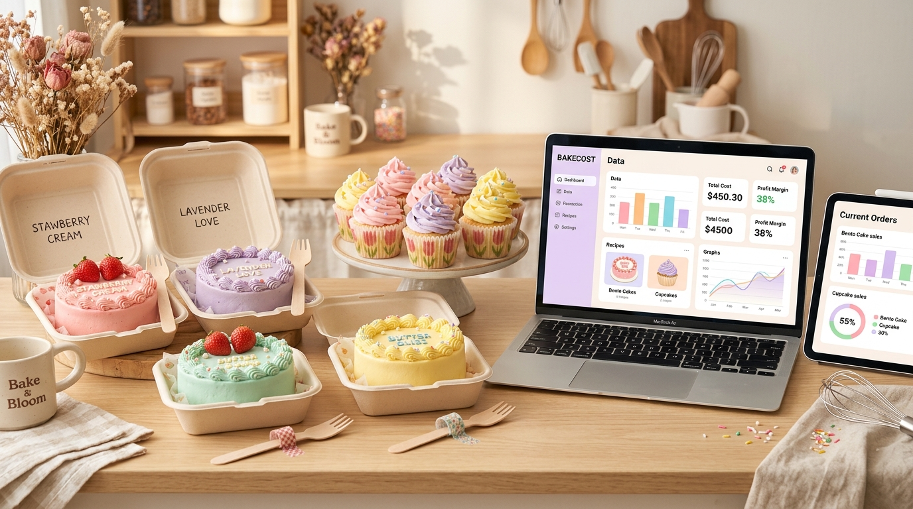

# 🎀 BakeCost — Cute Bento Cake & Gourmet Cupcake Costing Assistant



**BakeCost** is a cute, aesthetic browser extension and costing studio engineered specifically for home bakers, Korean bento lunchbox cake artists, cupcake creators, and boutique dessert businesses. 

It makes costing **mini 4-inch bento cakes**, **swirl cupcake batches**, and custom bakes effortless and accurate by capturing raw ingredients, hand-lettering decorating time, oven power, scrap wastage, clamshell boxes, wax papers, mini wooden cutlery, and profit pricing.

---

## 🎀 Cute Style Modes & Templates

| Style Mode | Features & Presets Included |
| :--- | :--- |
| **🍱 Cute Korean Bento Cake** | 4-inch mini sponge layers, pastel buttercream lettering, sugarcane clamshell bento box, gingham wax paper, mini wooden fork/spoon, striped bento candle, washi tape. |
| **🧁 Gourmet Cupcake Batch** | 6 or 12 batch scaling, tulip liners, 6-cavity/12-cavity window boxes, sky-high buttercream swirls, edible sugar pearls. |
| **🎂 Celebration Custom Cake** | 1kg+ celebration cakes, MDF boards, tall gift boxes, satin ribbons, acrylic toppers, and fresh flowers. |

---

## ✨ Key Features

### 1. 🍱 Bento Lunchbox & Cupcake Packaging Presets
- Sugarcane Clamshell Boxes (4-inch & 4.5-inch)
- Aesthetic Gingham & Floral Bento Wax Liners
- Mini Wooden Cutlery (Bento Forks & Spoons)
- Pastel Striped & Spiral Bento Candles
- Pastel Tulip Cupcake Liners & Greaseproof Cups
- 4-Cavity, 6-Cavity & 12-Cavity Window Boxes
- Decorative Washi Tape & Branding Stickers

### 2. 🎨 Pastel Lettering & Handcrafted Labor Wage
- Separate tracking for **Bake/Prep Time** and **Hand-Piped Lettering / Decorating Time**.
- Configurable hourly wage rate so you are always properly paid for intricate lettering and custom 3D character art.
- Oven power computation based on mini baking times (14–20 mins) and local electricity rates.

### 3. 🌾 Smart Unit & Density Converter
- Converts cups to exact grams for cake flour, fine castor sugar, butter, cocoa powder, and liquids.
- Real-time recipe cost auto-calculation: `(Quantity Used / Pack Size) × Pack Price`.
- Instant batch scaling: `0.5x`, `1x`, `1.5x`, `2x`, `3x`.

### 4. 💬 WhatsApp DM & Instagram Quotation Generator
- 1-click copy formatted WhatsApp order quote with custom message piping details, flavor descriptions, delivery deadlines, and payment terms.
- Printable official client quotation and internal master cost sheets.

### 5. 📊 Interactive Visualizer & Margin Health Meter
- Aesthetic SVG Donut chart displaying cost proportions.
- Margin Health Gauge with pastel color-coded status badges.
- Business alerts for zero-wage budgeting or high packaging costs.

---

## 🛠️ How to Install in Chrome / Edge / Brave

1. Open your browser and navigate to `chrome://extensions`.
2. Toggle on **Developer mode** in the top right corner.
3. Click **Load unpacked** in the top left corner.
4. Select this project directory (`c:\Users\Nandhini\New folder (2)`).
5. Pin **BakeCost 🎀** to your browser toolbar!

---

## 📂 Project Architecture

```text
├── manifest.json              # Chrome Manifest V3 extension configuration
├── popup.html                 # Compact cute popup interface
├── dashboard.html             # Full-screen Bento & Cupcake Studio
├── index.html                 # Web app demo & preview
├── css/
│   ├── style.css              # Cute pastel aesthetic design system & themes
│   ├── components.css         # Bento cards, style switcher, tables, badges
│   └── animations.css         # Micro-interactions & bouncy transitions
├── js/
│   ├── app.js                 # App controller & style preset switcher
│   ├── calculator.js          # Production costing engine & margin health
│   ├── pantry.js              # Bento boxes, tulip liners, and 45+ ingredients
│   ├── storage.js             # Storage layer with 5 cute pre-loaded recipes
│   ├── visualizer.js          # SVG Donut chart & margin gauge
│   ├── quote-generator.js     # WhatsApp DM quote & printable PDF sheet
│   ├── units.js               # Density-aware unit converter
│   └── background.js          # Manifest V3 service worker
└── assets/
    ├── icons/                 # Cute cupcake & bento PNG icons (16, 32, 48, 128px)
    └── images/                # Bento & cupcake workspace banner
```
